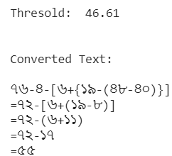

# Welcome to the BanglaOngko Dataset

The BanglaOngko dataset is a collection of images designed specifically for detecting and recognizing mathematical expressions written in the Bengali language. The dataset comprises 267 images that feature a diverse range of Bengali digits, operators, and parentheses. These images were captured using mobile-phone cameras and sourced from various demographics and individuals, including undergraduate students, general people of Bangladesh, and professionals.

The dataset encompasses a total of 21 classes, including Bengali digits from ০ to ৯, along with operators such as equals (=), minus (-), multiplication (×), division (÷), and addition (+). Furthermore, it includes parentheses (opening "(" and closing ")"), curly braces (opening "{" and closing "}"), and square brackets (opening "[" and closing "]"). The dataset consists of a total of 7,648 objects distributed across its 21 classes, including Bengali digits, operators, and parentheses.

# Image Processing and Output Text

<table>
  <thead>
    <tr>
      <th>Set No.</th>
      <th>Original Image</th>
      <th>Binarized Image</th>
      <th>Detected Image</th>
      <th>Output</th>
    </tr>
  </thead>
  <tbody>
    <tr>
      <td>1</td>
      <td></td>
      <td></td>
      <td></td>
      <td></td>
    </tr>
    <tr>
      <td>2</td>
      <td></td>
      <td></td>
      <td></td>
      <td></td>
    </tr>
    <tr>
      <td>3</td>
      <td></td>
      <td></td>
      <td></td>
      <td></td>
    </tr>
    <tr>
      <td>4</td>
      <td></td>
      <td></td>
      <td></td>
      <td></td>
    </tr>
  </tbody>
</table>

To facilitate object detection and recognition tasks, the dataset has undergone preprocessing steps. Initially, the images were subjected to inverse binarization, converting them into black and white format. This process enhances contrast and effectively separates foreground objects from the background. Subsequently, the dataset was annotated using Roboflow for object detection utilizing the YOLOv8 algorithm.

Please cite the following paper and this GitHub repository, if you use this dataset in your work:

Ashraf-Ul-Alam; Soumit Das; Sudipta Progga Islam, “BanglaOngko: A New Dataset for Accurate Bengali Mathematical Expression Detection Utilizing YOLOv8 Architecture”, doi: DOI will be added soon

The Bengali Mathematical Expression Detection dataset is highly valuable for developing algorithms to accurately detect and recognize Bengali mathematical expressions. It has numerous applications in document processing, automatic grading systems, handwriting recognition, and educational technology. Training on this dataset enables algorithms to efficiently interpret and analyze mathematical expressions, bringing automation and efficiency to tasks involving Bengali mathematics.

**Categories:**
- Mathematics
- Mathematics-Number
- Bengali Language
- Annotation
- Handwriting Recognition
- Optical Character Recognition
